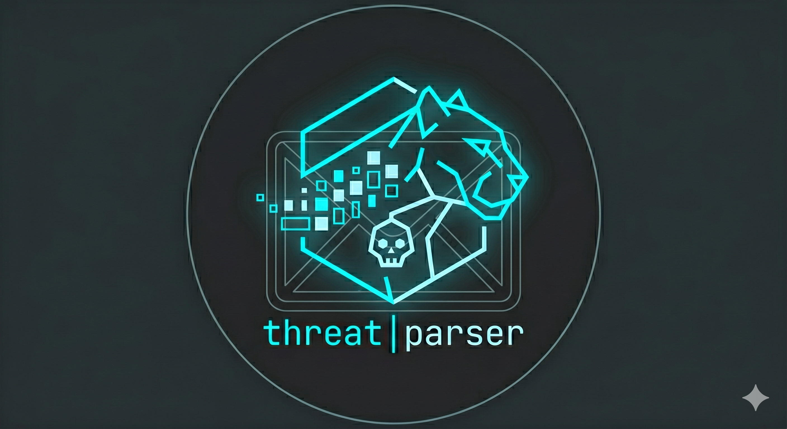

# ThreatParser



A Flask-based email threat analyser that parses `.eml` files and scores them for phishing, spam, and malware indicators. Optionally enriches results with VirusTotal and Abuse.CH URLhaus intelligence.

  

---

## Features

- **Header analysis** — SPF, DKIM, DMARC authentication checks; Reply-To mismatch detection
- **Brand impersonation detection** — 18 major brands cross-checked against legitimate sender domains
- **Keyword scoring** — separate phishing and spam keyword tracks
- **URL analysis** — heuristic pattern matching (raw IPs, URL shorteners, credential harvesting, tracking links, suspicious file extensions)
- **Attachment scanning** — flags dangerous file types (executables, macro-enabled documents, archives)
- **VirusTotal integration** — optional per-URL lookup via the VT API v3 (stdlib only, no extra packages)
- **Abuse.CH URLhaus integration** — optional per-URL lookup against the URLhaus malware URL database
- **Dual-track scoring** — independent phishing and spam scores produce a combined 0–100 threat score
- **Confidence tags** — every finding is tagged High / Medium / Low confidence
- **REST API** — `POST /api/analyze` returns full JSON results; API key auth and per-IP rate limiting included
- **Dark / light mode** — Bootstrap 5 with localStorage theme persistence

---

## Quick Start

### Requirements

- Python 3.10 or later
- No external packages beyond Flask (see below)

### Installation

```bash
# 1. Clone the repository
git clone https://github.com/CyberPanther232/ThreatParser.git
cd ThreatParser

# 2. Create and activate a virtual environment
python -m venv pyenv

# Windows
pyenv\Scripts\activate

# macOS / Linux
source pyenv/bin/activate

# 3. Install dependencies
pip install flask

# 4. (Optional) copy and edit the environment file
copy .env.example .env
```

### Running

```bash
python run.py
```

Open `http://127.0.0.1` in your browser.

### Running with HTTPS (TLS)

ThreatParser supports optional TLS at startup via environment variables.

#### Option A: local testing with a temporary self-signed cert

```bash
# Windows PowerShell
$env:THREATPARSER_SSL_ENABLED="true"
$env:THREATPARSER_SSL_ADHOC="true"
python run.py
```

Then open `https://127.0.0.1` (or your configured host/port).

#### Option B: use your own certificate and key (recommended)

```bash
# Windows PowerShell
$env:THREATPARSER_SSL_ENABLED="true"
$env:THREATPARSER_SSL_CERT_FILE="C:\\certs\\threatparser.crt"
$env:THREATPARSER_SSL_KEY_FILE="C:\\certs\\threatparser.key"
$env:THREATPARSER_PORT="443"
python run.py
```

When TLS is enabled, use `https://` for the UI and API endpoints.

> **Note for Windows users:** if the venv `activate` script fails in PowerShell, run the app directly with the venv interpreter:
>
> ```powershell
> .\pyenv\Scripts\python.exe run.py
> ```

---

## Usage

### Web UI

1. Go to `http://127.0.0.1`
2. Upload an `.eml` file (max 10 MB)
3. Optionally paste a VirusTotal API key and/or an Abuse.CH URLhaus Auth-Key
4. Click **Analyze Email**

Results show:

- Threat score ring (0–100) with colour-coded verdict
- Findings list with severity, type (PHISHING / SPAM), confidence, and detail
- Full header table
- URL table with heuristic flags, VirusTotal results, and URLhaus results
- Attachment list with dangerous-file indicators
- File hashes (MD5, SHA-1, SHA-256) for deduplication

### REST API

#### Analyze an email

```http
POST /api/analyze
Content-Type: multipart/form-data
X-API-Key: <your-api-key>          (omit if no API keys configured)
X-VT-API-Key: <vt-key>             (optional)
X-URLhaus-API-Key: <uh-key>        (optional)

eml_file=@path/to/email.eml
```

cURL example:

```bash
curl -X POST http://127.0.0.1/api/analyze \
  -H "X-API-Key: mysecretkey" \
  -F "eml_file=@sample_email.eml"
```

#### Health check

```http
GET /api/health
```

#### API reference

```http
GET /api/docs
```

---

## Configuration

Copy `.env.example` to `.env` and set any of the variables below. All are optional — the app runs with safe defaults without a `.env` file.

| Variable                            | Default     | Description                                                                            |
| ----------------------------------- | ----------- | -------------------------------------------------------------------------------------- |
| `SECRET_KEY`                      | random      | Flask session secret. Set a fixed value in production.                                 |
| `THREATPARSER_API_KEYS`           | *(none)*  | Comma-separated list of valid API keys. If empty, the API is open.                     |
| `THREATPARSER_RATE_LIMIT_ANALYZE` | `20`      | Max requests/minute to `POST /api/analyze` per IP.                                   |
| `THREATPARSER_RATE_LIMIT_HEALTH`  | `60`      | Max requests/minute to `GET /api/health` per IP.                                     |
| `THREATPARSER_TRUSTED_PROXY`      | *(none)*  | IP of a trusted reverse proxy. When set,`X-Forwarded-For` is used for rate limiting. |
| `THREATPARSER_HOST`               | `0.0.0.0` | Bind host for the Flask server.                                                        |
| `THREATPARSER_PORT`               | `80`      | Bind port for the Flask server.                                                        |
| `THREATPARSER_DEBUG`              | `true`    | Enables Flask debug mode. Disable in production.                                       |
| `THREATPARSER_SSL_ENABLED`        | `false`   | Enables HTTPS/TLS for the Flask server.                                                |
| `THREATPARSER_SSL_CERT_FILE`      | *(none)*  | Path to PEM certificate file for TLS.                                                  |
| `THREATPARSER_SSL_KEY_FILE`       | *(none)*  | Path to PEM private key file for TLS.                                                  |
| `THREATPARSER_SSL_ADHOC`          | `false`   | Use Werkzeug temporary self-signed cert (dev/testing only).                            |
| `THREATPARSER_TURNSTILE_SITE_KEY` | *(none)*  | Cloudflare Turnstile site key for rendering the widget on the upload form.             |
| `THREATPARSER_TURNSTILE_SECRET_KEY` | *(none)* | Cloudflare Turnstile secret key for server-side token verification.                     |
| `THREATPARSER_TURNSTILE_SITE_GATE` | `false`  | When true, require Turnstile verification before serving non-API web pages.             |

---

## Docker

A `Dockerfile` is included:

```bash
docker build -t threatparser .
docker run -p 80:80 threatparser
```

To expose HTTPS from the containerized app, publish port `443` and set TLS env vars,
plus mount certificate files into the container.

---

## Scoring System

See [SCORING.md](SCORING.md) for a full breakdown of every detection check, the points awarded, and how to tune the thresholds.

---

## Project Structure

```
ThreatParser/
├── app/
│   ├── __init__.py          # Flask app factory + config
│   ├── parser.py            # All parsing, scoring, and API integration logic
│   ├── routes.py            # Flask routes (web UI + REST API)
│   ├── security.py          # API key auth + in-memory rate limiter
│   ├── static/css/
│   │   └── style.css        # Custom CSS with dark/light CSS variables
│   └── templates/
│       ├── base.html        # Navbar, theme toggle
│       ├── index.html       # Upload form
│       ├── results.html     # Results page
│       └── about.html       # About page
├── run.py                   # Entry point
├── .env.example             # Environment variable reference
├── Dockerfile
├── SCORING.md               # Scoring system documentation
└── README.md
```

---

## Disclaimer

ThreatParser is a heuristic analysis tool intended to assist security-aware users in evaluating suspicious emails. It does not replace professional threat intelligence platforms or human judgement. Results may include false positives and false negatives. Never solely rely on an automated tool when assessing whether an email is malicious.

In it's original form ThreatParser does not store data on the server the application is running on. However, there always could be modifications performed by outside actors to change that standard behavior. Please do not upload proprietary, confidential, or sensitive emails to this application. I am not responsible for the potential data leakage this may cause.

---

## License

This project is provided as-is for educational and personal use.
